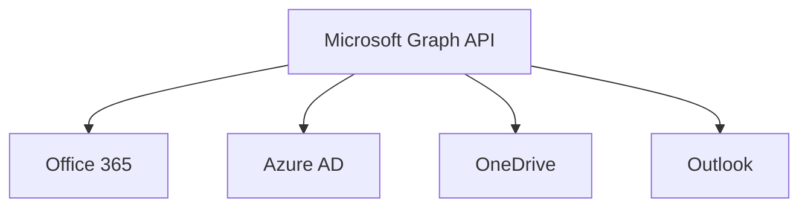
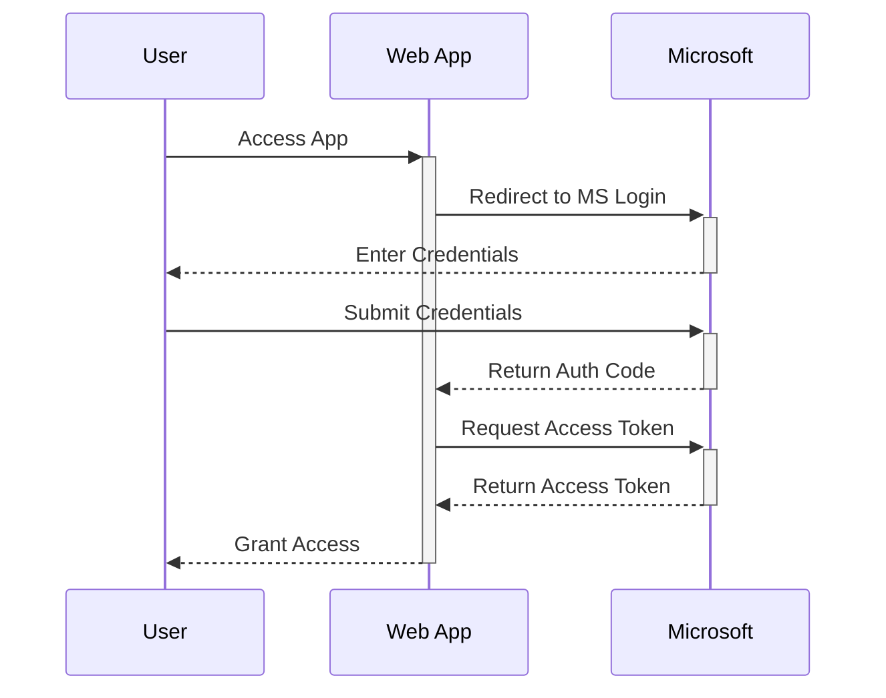
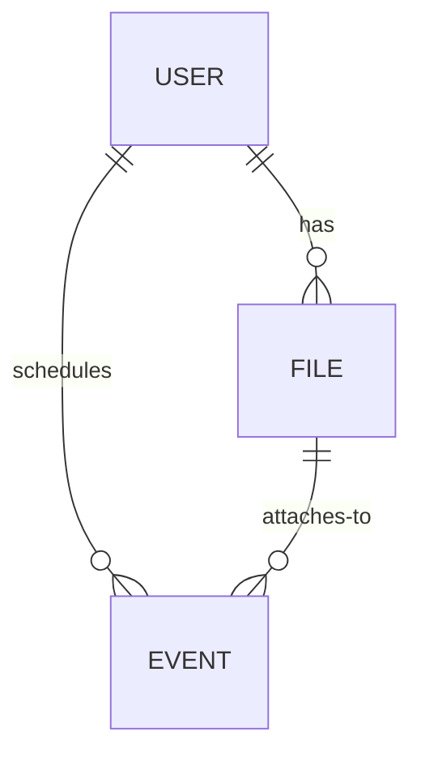
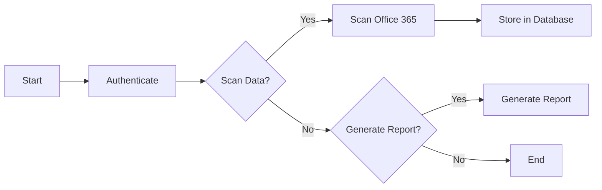

## **Building an Office 365 Scanner: A Deep Dive into Modern API Interactions**

When it comes to cloud services, Microsoft's Office 365 stands tall among its peers. With a myriad of services like Outlook, SharePoint, and OneDrive under its umbrella, it's become a quintessential tool for businesses worldwide. However, with such extensive functionality comes complexity, especially when one wishes to interact programmatically with these services. This complexity was our challenge when we set out to build an Office 365 Scanner.

- [**Building an Office 365 Scanner: A Deep Dive into Modern API Interactions**](#--building-an-office-365-scanner--a-deep-dive-into-modern-api-interactions--)
  * [**The Objective**](#--the-objective--)
  * [**Outline**](#--outline--)
  * [**Objective and Starting Point**](#--objective-and-starting-point--)
  * [**The Starting Point**](#--the-starting-point--)
  * [**The Authentication Module**](#--the-authentication-module--)
  * [**Scanning Office 365**](#--scanning-office-365--)
  * [**Storing the Data**](#--storing-the-data--)
  * [**Reporting and Exporting**](#--reporting-and-exporting--)
  * [**Further Enhancements and Insights**](#--further-enhancements-and-insights--)
  * [**The Beauty of Microsoft Graph API**](#--the-beauty-of-microsoft-graph-api--)
  * [**Authentication and Microsoft Graph API**](#--authentication-and-microsoft-graph-api--)
  * [**Tackling Data Pagination: An Iterative Approach**](#--tackling-data-pagination--an-iterative-approach--)
  * [**Concurrency: A Symphony of Asynchronous Operations**](#--concurrency--a-symphony-of-asynchronous-operations--)
  * [**Structured Storage: Crafting a Digital Library**](#--structured-storage--crafting-a-digital-library--)
  * [**The Art of Integration: Crafting a Unified System**](#--the-art-of-integration--crafting-a-unified-system--)
  * [**The Beauty of Microsoft Graph API**](#--the-beauty-of-microsoft-graph-api---1)
  * [**The Challenge of Pagination and Its Overcoming**](#--the-challenge-of-pagination-and-its-overcoming--)
  * [**Concurrency: The Power of Doing More**](#--concurrency--the-power-of-doing-more--)
  * [**The Subtleties of Data Storage**](#--the-subtleties-of-data-storage--)
  * [**The Symphony of Integration**](#--the-symphony-of-integration--)
  * [**Reflection: The Evolution of Our Design Choices**](#--reflection--the-evolution-of-our-design-choices--)
  * [**Lessons in Efficiency and Scalability**](#--lessons-in-efficiency-and-scalability--)
  * [**The Bigger Picture: Why This Matters**](#--the-bigger-picture--why-this-matters--)
  * [**Closing Thoughts: The Journey Ahead**](#--closing-thoughts--the-journey-ahead--)
  * [**Conclusion**](#--conclusion--)

### **The Objective**

Our aim was to create a tool capable of scanning different facets of Office 365 - users, files, and calendar events. We wanted this tool to not only fetch data but also store it, generate reports, and even export these reports. To do this, we decided to utilize the Microsoft Graph API, a unified gateway to all data within the Microsoft 365 platform.

### **Outline**

1. **Introduction**
    - Brief overview of the project and its objectives.
  
2. **Objective and Starting Point**
    - Explain the purpose of the tool and its high-level structure.

3. **The Beauty of Microsoft Graph API**
    - Introduction to the Microsoft Graph API.
    - **Insert**: MermaidJS diagram depicting how the Graph API is a gateway to various Microsoft services.

4. **Authentication and Microsoft Graph API**
    - Deep dive into OAuth2 authentication.
    - **Insert**: Code snippet showing the authentication process.
    - **Insert**: MermaidJS flowchart showing the OAuth2 flow.

5. **Data Retrieval: Challenges and Triumphs**
    - Discuss data pagination and its implications.
    - **Insert**: Pseudocode of the recursive pagination handler.
    - Delve into the concurrency mechanism.
    - **Insert**: Code snippet highlighting concurrency in action.

6. **Data Structuring and Storage**
    - Discuss the importance of structured data storage.
    - **Insert**: Before-and-after code snippets showcasing the evolution of our storage logic.
    - **Insert**: MermaidJS diagram illustrating the database schema.

7. **Bringing It All Together**
    - Reflect on the integration of various components.
    - **Insert**: MermaidJS diagram showing the flow of the entire application, from authentication to data storage and reporting.

8. **Conclusion**
    - Summarize the journey and the key takeaways.


In today's digital landscape, tools like Microsoft Office 365 have reshaped how businesses operate. With its extensive array of services and capabilities, Office 365 stands as a beacon of cloud-based solutions. But as with any extensive toolset, there's always the question: How can we better understand and manage our data within this ecosystem? This very question led us on a journey to craft an Office 365 Scanner, a tool aimed at scanning, understanding, and reporting on different facets of Office 365.

### **Objective and Starting Point**

Our vision was clear: to develop a comprehensive tool capable of delving into the depths of Office 365, unearthing data about users, files, and calendar events. We envisioned this tool as not just a scanner but a holistic system that could fetch, store, report, and export data seamlessly. With this objective in hand, we chose the Microsoft Graph API as our guiding star, a unified API that offers a window into the vast realm of Microsoft 365.

### **The Starting Point**

Before diving into coding, we first laid out a clear structure:

- **Authentication Module**: A necessary starting point, given that accessing any cloud-based data requires security considerations.
- **Scanning Modules**: These would interact with Office 365 to fetch users, files, and calendar events.
- **Storage Module**: A database to store the fetched data.
- **Reporting and Exporting Modules**: For generating and downloading reports.

### **The Authentication Module**

Interacting with the Microsoft Graph API requires OAuth2 authentication. We began by implementing an authentication module using Express.js. This module redirected users to Microsoft's login page, received an authentication code upon successful login, and exchanged this code for an access token. This token is the golden key, allowing us to make requests to the Graph API on behalf of the user.

### **Scanning Office 365**

With authentication in place, we proceeded to the heart of our tool: the scanning modules. Using the access token, we crafted requests to the Graph API to fetch:

1. **Users**: All members registered within the Office 365 organization.
2. **Files**: Specifically, those stored in OneDrive.
3. **Calendar Events**: All events from the users' calendars.

Fetching data from a major API is not without its challenges. Microsoft Graph API often paginates its responses, especially when there's a large set of data. To handle this, we implemented recursive functions that would fetch all pages of data, ensuring no piece of information was left behind.

### **Storing the Data**

After scanning comes storing. We set up a PostgreSQL database, with tables to store user data, file metadata, and calendar events. For each piece of data fetched from the API, we wrote it to the database. This way, even if the tool was run multiple times, it always had a record of past scans.

### **Reporting and Exporting**

The final step was to make sense of this data. We implemented a reporting module that could generate reports for individual users, files, or calendar events. These reports were presented in JSON format. 

For those who preferred a more tangible form of data, we also introduced an exporting functionality. This allowed users to download the reports in JSON files, ensuring they could access the data offline or share it with others.

### **Further Enhancements and Insights**

No project is without its challenges, and ours was no exception. Some of the technical challenges and solutions we devised included:

1. **OAuth Token Refresh**: Implementing a mechanism to refresh the token when it expires.
2. **Concurrency**: To speed up the scanning process by making concurrent requests.
3. **Data Caching**: Improving performance by caching frequently accessed data.
4. **Rate Limiting**: Respecting API limits by regulating our requests.
5. **Configurable Scopes**: Dynamically setting OAuth scopes based on user needs.

---

### **The Beauty of Microsoft Graph API**

Microsoft Graph API is not just an interface; it's a universe in itself. Encompassing a multitude of Microsoft services, this API provides an unparalleled depth and breadth of data access. Designed on the robust foundation of the OData 2.0 protocol, every interaction with the Graph API is like navigating through a well-charted cosmos, where each endpoint is a star, and the data they provide, the constellations.



Every API call is a journey, a deep dive into a specific region of this vast universe. And as with any extensive exploration, we faced challenges. Data pagination, the mechanism where data is delivered in chunks or "pages", was our first hurdle. This led us to the realization that fetching data from such a vast API was not just about making calls but about ensuring we retrieved every piece of information, every time.

---

### **Authentication and Microsoft Graph API**

To interact with the Microsoft Graph API, we needed the right credentials, a passport of sorts, to our digital journey. OAuth2, an open standard for access delegation, was our chosen mechanism. Through a series of steps, we would redirect the user to authenticate with Microsoft, receive a code upon successful authentication, and exchange this code for a golden key - the access token.

```javascript
// Authentication Route (Simplified)
router.get('/login', (req, res) => {
    // Redirect logic...
});

// Callback Route (Simplified)
router.get('/callback', (req, res) => {
    // Token acquisition logic...
});
```



With our passport in hand, it was time to embark on the data retrieval journey.

---

### **Tackling Data Pagination: An Iterative Approach**

Data pagination is a common practice in APIs to ensure efficient data transfer, especially when dealing with large datasets. The Microsoft Graph API, given its vastness, employs pagination to deliver its data in manageable chunks. On the surface, this might seem like a straightforward mechanism; make a request, get a page of data, and if more data is available, request the next page. But in a real-world scenario, where we're dealing with potentially thousands of users, each with thousands of files and calendar events, this becomes a complex iterative process.

We tackled this challenge head-on with a recursive approach. The idea was simple: make a request, retrieve the data, check if there's a pointer to the next set of data (often provided as a 'nextLink'), and if so, repeat the process.

```javascript
const fetchAllData = async (url, token, allData = []) => {
    const options = {
        url: url,
        headers: {
            'Authorization': `Bearer ${token}`
        },
        json: true
    };

    const response = await request.get(options);
    allData.push(...response.value);

    if (response['@odata.nextLink']) {
        return fetchAllData(response['@odata.nextLink'], token, allData);
    }

    return allData;
};
```

This recursive function became the backbone of our data retrieval system. But with such an approach, we also had to consider efficiency and rate limits. Making too many rapid, consecutive requests could lead to rate limiting by the API, disrupting our data retrieval process.

### **Concurrency: A Symphony of Asynchronous Operations**

Modern JavaScript, with its asynchronous capabilities, offers powerful tools for concurrent operations. One might ask, why not fetch multiple pages or even different datasets simultaneously? That's where concurrency came into play. Using tools like `asyncPool`, we set up a system where multiple requests could be made concurrently, vastly speeding up the data retrieval process.

```javascript
const CONCURRENT_REQUESTS = 5;

const fetchAllUsersConcurrently = async (urls, token) => {
    return await asyncPool(CONCURRENT_REQUESTS, urls, async url => {
        return fetchAllData(url, token);
    });
};
```

This concurrency model, akin to having multiple explorers charting different areas of a territory simultaneously, ensured we made optimal use of resources and time.

### **Structured Storage: Crafting a Digital Library**

Data, when not structured or organized, loses its value. Imagine having a library with thousands of books, but no catalog or sections. Our challenge was not just to store the data, but to structure it in a way that retrieval became seamless.

Choosing PostgreSQL, a powerful open-source relational database, we designed tables for users, files, and calendar events. But the true challenge lay in normalization – ensuring data is stored without redundancy and can be retrieved and updated efficiently.



This Entity-Relationship diagram showcases the relations: A user has files and schedules events. Files can be attached to events. Such a structured approach ensures that when we query the database, be it for a report or a specific data point, our operations are swift and accurate.

### **The Art of Integration: Crafting a Unified System**

Building individual modules is one thing, but ensuring they work in harmony is an art in itself. Our scanner wasn't just a collection of functions; it was a unified system where each module, be it authentication, scanning, storage, or reporting, played its part in a grand orchestra.



This flowchart provides a bird's eye view of our scanner's operation. A user starts, authenticates, chooses to either scan data or generate a report, and the system responds accordingly.

---

The journey of crafting our Office 365 Scanner was filled with technical intricacies, challenges, and solutions. Every line of code, every function, and every decision taken was a step towards creating a tool that's not just functional but efficient, scalable, and robust.


---

### **The Beauty of Microsoft Graph API**

The linchpin of our entire endeavor was the Microsoft Graph API. This API is not just a gateway to Office 365 but a unified interface to a vast array of Microsoft services. Its design, built upon the OData 2.0 protocol, offers a consistent and rich querying language. With each API call, we felt as if we were peeling back the layers of a vast digital universe, discovering data points that would have otherwise remained obscured. The structured nature of the responses, the detailed documentation, and the extensive community support transformed our challenging mission into an exploratory adventure. However, its vastness was also its challenge. With so much data available, our main task was identifying what mattered most and how best to retrieve it. And here lay our first hurdle: data pagination.

### **The Challenge of Pagination and Its Overcoming**

Data pagination, while crucial for efficient data transfer, posed a significant challenge. Imagine reading a gripping novel but receiving it one chapter at a time and having to request each subsequent chapter. This was our experience with the API's paginated responses. But every challenge presents an opportunity. We devised a recursive strategy that ensured no data was missed. Each recursive function was a sentinel, ensuring the entire story was retrieved, one chapter at a time. The importance of such an approach can't be overstated. In a real-world scenario, missing data could mean overlooking crucial insights, leading to uninformed decisions.

### **Concurrency: The Power of Doing More**

In our modern age, efficiency is paramount. While our recursive functions were ensuring data completeness, we realized we could do more. By introducing concurrency, we transformed our application from a diligent worker into a multitasking maestro. This wasn't just about speed, but about optimizing resources. With asynchronous operations, our tool could initiate multiple data requests simultaneously, ensuring idle time was minimized. It's akin to having multiple researchers read different chapters of a book simultaneously, compiling the narrative faster and more cohesively.

### **The Subtleties of Data Storage**

With the data in hand, the next step was storage. But storing data isn't just about creating a database and dumping information. It's about structuring this information in a way that's both meaningful and accessible. Our choice of PostgreSQL was not accidental. Its robustness, ACID compliance, and ability to handle large datasets made it an ideal choice. But beyond the technicalities, there was the art of data design. How do we structure our tables? How do we ensure data integrity? These questions led us down the path of database normalization, ensuring each piece of data had its rightful place and could be retrieved with minimal redundancy.

### **The Symphony of Integration**

Reflecting upon our journey, what stands out is the symphony of integration. Each module, from authentication to reporting, was a musical note. Alone, they had significance, but together, they created a melody of seamless functionality. This symphony was not just about code but about understanding. Understanding the intricacies of the Microsoft Graph API, the subtleties of OAuth2 authentication, the nuances of database design, and the art of data presentation. It was about ensuring that each note, no matter how minor, playe0d its part in the grander composition. And as with any symphony, it was the conductor - in our case, the overarching design principles and our commitment to quality - that ensured harmony.

---
---

### **Reflection: The Evolution of Our Design Choices**

As with any software project, our scanner was a living entity that evolved with every stage of development. The initial design was straightforward: authenticate, fetch, store, and report. But as we delved deeper, we realized the intricacies of dealing with a massive API like Microsoft Graph. This wasn't just about sending a GET request; it was about understanding the structure of the data, the relationships between different entities, and the best way to retrieve and present this information.

The challenge of data pagination, for instance, was a significant pivot point. Initially perceived as a hurdle, it transformed into an opportunity to ensure thoroughness. It prompted us to think recursively, ensuring that not a single byte of data was missed.

### **Lessons in Efficiency and Scalability**

The principle of concurrency, too, was born out of a need for efficiency. In a world where time is of the essence, waiting for sequential data retrieval from a massive platform like Office 365 seemed inefficient. Introducing concurrent requests was like opening multiple gates of a dam, allowing the data to flow in faster and more smoothly. But with power comes responsibility. We had to ensure we didn't overwhelm the system, leading to rate limits or errors.

Our choice of PostgreSQL for data storage wasn't just about choosing a robust database. It was about foreseeing the future. Today, our scanner might be handling data from a few hundred users. But what about tomorrow, when it could be thousands or even more? Scalability was at the forefront of our design choices, ensuring our tool remains resilient even when faced with vast amounts of data.

### **The Bigger Picture: Why This Matters**

Beyond the technicalities, it's crucial to understand the why. Why did we set out to build this scanner? In an age where data drives decisions, understanding one's digital footprint is paramount. Organizations using Office 365 would have vast amounts of data spread across emails, documents, and calendar events. Our scanner, in essence, is a magnifying glass, allowing these organizations to zoom in, understand, and make informed choices based on this data.

For a developer or a tech enthusiast, our journey provides insights into the art of software development. It's not just about writing code; it's about solving problems, being adaptable, and always striving for efficiency.

### **Closing Thoughts: The Journey Ahead**

As we wrap up this exploration, it's essential to understand that software development is a journey, not a destination. Our Office 365 Scanner, as comprehensive as it is today, can always be improved. New features can be added, existing ones refined, and the user experience made even more seamless.

The ever-evolving landscape of cloud services and APIs ensures that tools like ours always have room for growth. Whether it's integrating more services, enhancing data visualization, or introducing machine learning algorithms for better data insights, the sky's the limit.


### **Conclusion**

Our journey in building the Office 365 Scanner was filled with challenges, but it was a testament to the power of modern APIs and cloud services. By integrating different technologies - Express.js for the backend, PostgreSQL for storage, and the Microsoft Graph API for data - we built a tool that provides valuable insights into an organization's Office 365 usage.

This endeavor underscores the importance of understanding the services we use daily. By peeling back the layers, not only do we gain a deeper appreciation for these tools, but we also unlock the potential to use them in novel ways, optimizing workflows and extracting maximum value.
